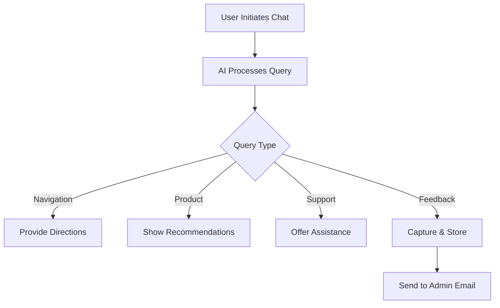

# MokeSell Interactive Web Application

## Overview
EVA is a new online platform that lets users buy and sell both new and second-hand goods. The goal of this web application is to create an engaging shopping experience, allowing users to enjoy shopping while unlocking rewards, competing for the best deals, exploring a user-friendly interface, and taking quizzes to help find products that suit their needs. This platform aims to enhance online shopping with a fun, interactive experience.

## Table of Contents
- [Design Concept](#design-concept)
- [Features](#features)
  - [E-commerce Experience](#ecommerce-experience)
  - [User Account Management](#user-account-management)
  - [Listing Management](#listing-management)
  - [Search and Browsing](#search-and-browsing)
  - [Communication and Transactions](#communication-and-transactions)
  - [Feedback and Support](#feedback-and-support)
  - [Additional Features](#additional-features)
- [Technologies Used](#technologies-used)
- [Installation](#installation)
- [Testing](#testing)
  - [User Testing](#user-testing)
  - [Bug Fixes](#bug-fixes)
- [Credits and References](#credits-and-references)
- [Acknowledgements](#acknowledgements)

## Design Concept
As users browse and purchase items, they can unlock rewards, vouchers, and earn badges. The design incorporates a bright, modern aesthetic with easy navigation to enhance the shopping experience.

### User Audience
- **Shoppers**: Individuals looking for both new and second-hand items.
- **Sellers**: Users wanting to list their items for sale.

### Purpose and Intent
The platform aims to drive user interaction and encourage frequent engagement while offering a reliable marketplace for buying and selling items.

## Features

### E-commerce Experience
- **Discount Offers**: Users can earn exclusive discounts by engaging in the platform's interactive features and by competing for deals.

### User Account Management
- **Account Creation**: Users can create an account to purchase and sell items, earn and redeem rewards and vouchers.
- **Profile Management**: Users can update their profiles and account settings, including changing contact information or passwords.
- **Order History**: Users can view their past purchases, track orders, and check their rewards history.
- **Purchase Preferences**: Users can specify their purchase preferences such as product categories, price range, and item condition, allowing for a more personalized shopping experience.

### Listing Management
- **Create Listings**: Sellers can list items by uploading photos, providing descriptions, and selecting categories.
- **Sell Multiple Items**: Sellers can list multiple items on the site.

### Search and Browsing
- **Search Functionality**: Users can search for items using keywords and filter by category, price range, or item condition.
- **Category Browsing**: Browse through categories like electronics, clothing, furniture, etc.

### Communication and Transactions
- **Chat Feature**: Buyers and sellers can communicate directly through an integrated chat feature to discuss product details and negotiate offers. (Tried to implement but failed)


### Feedback and Support
- **Feedback Submission**: Users can submit feedback on their experiences or report issues.
- **Review Chatbot** Users on the site can send feedback on our site to the chatbot which will directly send us an email regarding what the feedback is about and the email of the user who made the feedback.
  
### Additional Features
- **Transaction History**: Users can view their past transactions, including purchases, sales, and reviews.
- **Ads Listings**: Sellers can pay to feature their listings or post advertisements on the site, allowing their product or post to be marketed to users who are using the site.
- **Personalized Recommendations**: Based on users’ preferences and past activity, the platform recommends products they might like, making the shopping experience more tailored.

### Feedback System
   - Test email capture
   - Verify feedback storage
   - Check conversation history
   - Test admin notification system
   
### Customer Support Flow



## Technologies Used
- **HTML5**: Used for the overall structure and layout of the website.
- **CSS3**: For styling the website with modern, responsive design elements.
- **JavaScript**: To create interactive elements, including the gamified shopping experience, chat functionality, and real-time updates for the cart.
- **APIs**: Various third-party APIs (e.g., for payment gateway integration, user authentication) are used to enhance functionality.
- **Lottie Animation**: Integrated to provide dynamic, visually appealing animations that enhance the interactive experience.
- **Database Integration**: The platform integrates with a database for managing user accounts, product listings, and transaction history.

## Installation

To run this project locally, follow these steps:
1. Clone the repository:
```bash
git clone https://github.com/yourusername/MokeSell.git
```
2. Navigate to the project directory:
```bash
cd MokeSell
```
3. Open `index.html` in your preferred web browser to view the site.

## Testing

### User Testing
- Perform functional testing of the shopping cart, search feature, and user login system.
- Conduct usability testing to ensure that the shopping experience is smooth and the gamification elements are intuitive.
- Test the listing creation process and the process of placing offers and following sellers.

### Bug Fixes
- Fix issues related to navigation inconsistencies (e.g., difference between `index.html` and `browse.html` nav menus).
- Resolve problems with the real-time chat feature, ensuring messages are properly sent and received.

## Credits and References
- Images and other media used in this project are sourced from various online archives and free resources.
- Inspiration for the design and gamification features came from popular eCommerce platforms and gaming apps. (e.g., Shopee [https://shopee.sg/])
- Design [https://www.youtube.com/watch?v=OXGznpKZ_sA]
- YT login/signup [https://www.youtube.com/@techmakersnocode] [https://www.youtube.com/@coding2go]
- IG [https://www.instagram.com/web_development_legend/] [https://www.instagram.com/the_coding_wizard/]
- Icons [https://fontawesome.com/start]
- Connect Login & Sign up Form with DATABASE[https://www.youtube.com/watch?v=TRHtOixzrH8] [https://www.youtube.com/watch?v=EQii31gG51Q] [https://restdb.io/docs/javascript-api#restdb] [https://www.sitepoint.com/how-to-get-started-with-restdb-io-and-create-a-simple-cms/]
- ChatGPT [https://chatgpt.com/]
- Claude AI [https://claude.ai/]
- Jotform [https://www.jotform.com/agent/build/0194e55c77377697a8d98ac9f4e1fad8b333/train]

## Acknowledgements
- Connect Login & Sign up Form with DATABASE[@LX]
- The concepts of PHP and how it interacts with SQL to retrieve data[@LX]

---

This updated README now includes features for **user-specified purchases**, **listing ads**, and **selling listing items**, along with a comprehensive view of the platform's functionalities.
